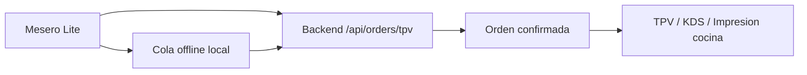

# Meseros Lite

App ligera de comanda para meseros en tablets Android de bajos recursos. Forma parte del monorepo MRTPVREST y comparte backend, tipos y reglas multi-tenant con el TPV principal, pero evita cargar modulos administrativos, graficas y efectos visuales costosos.

## Objetivo

Meseros Lite esta pensada para piso de servicio: seleccionar mesa, armar comanda, elegir variantes/modificadores y guardar el ticket aun si la tablet pierde WiFi. La meta visual y tecnica es mantener una interfaz solida, rapida y usable con pulgares.

## Stack

- Next.js 16
- React 19
- TailwindCSS
- Zustand con persistencia local
- Axios
- Lucide React
- Backend MRTPVREST en `apps/backend`

## Diseno: Solid Warm Tech

La app usa una UI plana para reducir trabajo de GPU en tablets economicas.

- Fondo base: `#0a0a0c`
- Superficies/tarjetas: `#121214`
- Barra inferior: `#0c0c0e`
- Texto: `neutral-200`
- Acento: Ambar miel `#ffb84d`
- Tipografia: Outfit

Reglas obligatorias:

- No usar `hover:`
- No usar `backdrop-blur`
- No usar blur
- No usar gradientes
- No usar `bg-opacity` ni opacidades visuales costosas
- No usar sombras complejas
- Botones tactiles con `min-h-[64px]` o `min-h-[72px]`
- Estados de toque con `active:scale-95 transition-all duration-150`

## Rutas principales

| Ruta | Uso |
| --- | --- |
| `/setup` | Alta de tablet: login admin, seleccion de restaurante y sucursal |
| `/pin` | Entrada de mesero por PIN |
| `/mesas` | Mapa de salon y seleccion de mesa |
| `/menu` | Catalogo, variantes, modificadores y ticket activo |
| `/perfil` | Perfil del empleado, XP, respaldo local y cambio de mesero |

## Flujo operativo

1. El encargado abre `/setup`.
2. Inicia sesion con cuenta admin.
3. Selecciona restaurante y sucursal.
4. La tablet guarda `restaurantId` y `locationId`.
5. La app limpia el token admin y manda a `/pin`.
6. El mesero entra con su PIN.
7. La app guarda el token de empleado.
8. El mesero selecciona mesa en `/mesas`.
9. Agrega productos desde `/menu`.
10. El ticket se guarda en backend o se encola offline si no hay red.

## Sesion de mesero

La sesion de empleado vive separada de la configuracion admin.

Archivos principales:

- `src/app/pin/page.tsx`
- `src/store/useEmployeeSessionStore.ts`
- `src/components/SessionGate.tsx`
- `src/lib/api.ts`

Datos locales usados:

- `tpv-employee-token`
- `currentEmployeeId`
- `currentEmployeeName`
- `currentEmployeeRole`
- `restaurantId`
- `locationId`
- `meseros-lite-workspace`

El `SessionGate` protege las rutas privadas. Si no hay empleado activo, cualquier intento de abrir `/mesas`, `/menu` o `/perfil` redirige a `/pin`.

## Multi-tenant

Todas las interacciones con API deben mandar:

- `x-restaurant-id`
- `x-location-id`
- `Authorization: Bearer <token-de-empleado>`

El interceptor en `src/lib/api.ts` inyecta estos valores desde `localStorage`. En desarrollo tiene fallback a los IDs locales de prueba para facilitar pruebas en `localhost`.

## Offline-first

La app persiste datos criticos en `localStorage` para evitar perdida de servicio cuando la tablet pierde WiFi.

Stores:

- `src/store/useWaiterOrderStore.ts`
- `src/store/useOfflineQueueStore.ts`

Utilidades:

- `src/lib/offline.ts`
- `src/components/OfflineSyncInitializer.tsx`

Persistencia local:

- Ticket activo
- Mesa activa
- Mesas asignadas/cacheadas
- Cola de transacciones pendientes

Cuando guardar una comanda falla por red o error temporal del servidor, se crea una transaccion offline con `Idempotency-Key`. Al regresar la conexion, `initBackgroundSync` intenta reenviar la cola.

## Catalogo

La vista de catalogo vive en:

- `src/app/menu/page.tsx`

Consume:

- `GET /api/menu/categories`
- `GET /api/menu/items`

Soporta:

- Categorias grandes para toque
- Productos reales del backend
- Cache local de catalogo
- Variantes multiples
- Modificadores
- Complementos
- Notas
- Cantidad
- Ticket compacto visible
- Boton para guardar comanda

## Mesas

La vista de mesas vive en:

- `src/app/mesas/page.tsx`

Consume:

- `GET /api/tables`

Soporta:

- Mesas reales del backend
- Cache local
- Agrupacion por zona
- Seleccion de mesa
- Apertura directa de comanda

## Backend requerido

Para pruebas locales:

```bash
pnpm --filter @mrtpvrest/backend dev
pnpm --filter @mrtpvrest/meseros-lite dev
```

Puertos usados durante desarrollo:

- Backend: `http://localhost:3001`
- Meseros Lite: `http://localhost:3008`

Endpoints usados:

- `POST /api/auth/login`
- `GET /api/workspaces/me`
- `POST /api/employees/login`
- `GET /api/tables`
- `GET /api/menu/categories`
- `GET /api/menu/items`
- `POST /api/orders/tpv`

## Comandas a cocina

Meseros Lite no imprime directamente desde la tablet. La app guarda o encola la comanda en backend. El backend/TPV/KDS es quien debe disparar la impresion o mostrar la orden en cocina segun la configuracion del restaurante.

Este enfoque evita depender de drivers, Bluetooth o impresoras locales en tablets de bajo rendimiento y conserva un flujo mas confiable:



## Verificacion rapida

```bash
pnpm --filter @mrtpvrest/meseros-lite type-check
rg -n "hover:|backdrop|blur|gradient|opacity-|bg-opacity|shadow" apps/meseros-lite
```

El segundo comando no debe regresar resultados.

## Estructura recomendada

```text
apps/meseros-lite
  src
    app
      layout.tsx
      globals.css
      page.tsx
      setup/page.tsx
      pin/page.tsx
      mesas/page.tsx
      menu/page.tsx
      perfil/page.tsx
    components
      BottomNavigation.tsx
      OfflineSyncInitializer.tsx
      SessionGate.tsx
    lib
      api.ts
      config.ts
      offline.ts
    store
      useEmployeeSessionStore.ts
      useOfflineQueueStore.ts
      useWaiterOrderStore.ts
```

## Criterios de aceptacion

- La app no permite operar sin PIN de mesero.
- `/setup` solo configura restaurante/sucursal y despues envia a `/pin`.
- `/mesas`, `/menu` y `/perfil` requieren empleado activo.
- Todas las llamadas a API incluyen tenant.
- El ticket activo sobrevive recargas.
- Las comandas se encolan si se pierde conexion.
- No hay efectos visuales pesados para GPU.
- Los controles tactiles mantienen tamano minimo generoso.
