

  

<h1 align="center">Guía de uso — MRTPV Retail</h1>

  Punto de venta para tu tienda · Ropa · Ferretería · Refaccionaria 
  Manual del comerciante y del instalador · para la versión 1.0.6 de la app

---

> **Nota para el equipo.** Esta guía está pensada para el comerciante, no para desarrolladores.
> Si cambias una pantalla del POS o del panel, actualiza la captura correspondiente en
> `docs/img/guia/`. Las capturas se toman manejando la app real (dev en `:3012` apuntando
> al backend de producción) contra el tenant demo `ferreteria-el-constructor`, para que
> salgan con datos de verdad y no con pantallas vacías.

## Contenido

**Operar la caja**
1. [Qué es MRTPV Retail](#1-qué-es-mrtpv-retail)
2. [Crear tu tienda y entrar](#2-crear-tu-tienda-y-entrar)
3. [Cargar el catálogo](#3-cargar-el-catálogo)
4. [Precios: listas y mayoreo](#4-precios-listas-y-mayoreo)
5. [Vender y cobrar](#5-vender-y-cobrar)
6. [Devoluciones](#6-devoluciones)
7. [Turnos y corte de caja](#7-turnos-y-corte-de-caja)
8. [Inventario](#8-inventario)
9. [Panel de control](#9-panel-de-control)

**Instalar y equipar**

10. [Instalar el software](#10-instalar-el-software)
11. [Hardware recomendado](#11-hardware-recomendado)
12. [Conectar el equipo](#12-conectar-el-equipo)
13. [Actualizaciones](#13-actualizaciones)
14. [Solución de problemas](#14-solución-de-problemas)

---

## 1. Qué es MRTPV Retail

MRTPV Retail es la **caja registradora** de tu negocio. Reemplaza la libreta y la calculadora: escaneas un producto, cobras, imprimes el ticket y el sistema descuenta el inventario solo. Todo queda guardado en la nube, así que puedes revisar tus ventas desde cualquier lado.

Está pensado para **tres giros**, y se adapta al tuyo. No es la misma caja con otro nombre: los campos, las etiquetas y las herramientas cambian según lo que vendes.

| Giro | Cómo se adapta |
|---|---|
| **Ropa** | Vendes por talla y color. El catálogo arma una matriz talla × color por prenda. |
| **Ferretería** | Vendes por pieza, metro, kilo o caja. Precio de mostrador y de contratista, con mayoreo por volumen. |
| **Refaccionaria** | Buscas por número de parte y por compatibilidad de vehículo (marca, modelo, año). |

La caja tiene **dos accesos**: el **panel de administración** (una página web donde cargas productos, ves reportes y descargas la app) y la **caja** propiamente (la app de escritorio o tablet donde el cajero cobra).

---

## 2. Crear tu tienda y entrar

Antes de vender pasa una sola vez por dos pasos: crear la cuenta de tu tienda y **vincular** la caja a tu sucursal. Después, el cajero solo teclea su PIN.

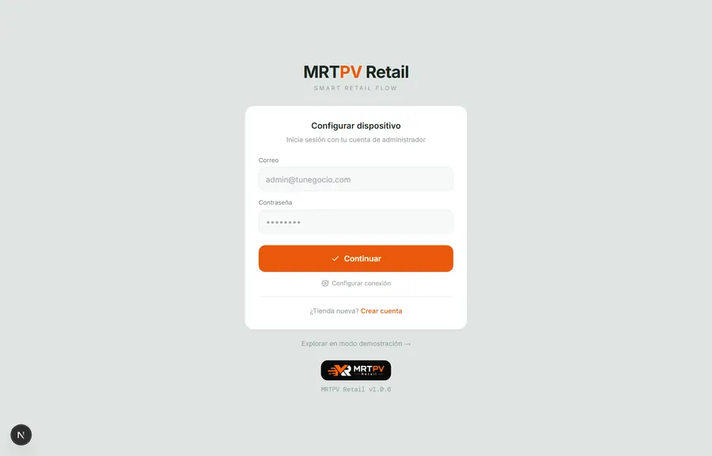
Así abre la caja la primera vez: entras con tu correo y contraseña de administrador, o creas la tienda desde cero.

### Si es tu primera vez: crea la tienda

1. **Abre la app de la caja.** Verás la pantalla *Configurar dispositivo*.
2. **Toca "¿Tienda nueva? Crear cuenta".** Escribe el nombre de tu negocio, tu nombre, tu correo y una contraseña. Elige tu giro.
3. **Listo.** El sistema crea tu tienda, tu sucursal principal y un cajero con **PIN inicial 1234**.

> [!TIP]
> **Cambia el PIN 1234.** Es solo para arrancar. Cámbialo desde *Configuración → Seguridad con PIN* en cuanto entres, sobre todo si más de una persona usa la caja.

### Vincular la caja a tu sucursal

Si la tienda ya existe (o instalas una segunda caja):

1. **Escribe tu correo y contraseña de administrador.** Toca **Continuar**.
2. **Elige la sucursal** donde va a operar esta caja.
3. **Queda vinculada.** El equipo ya no vuelve a pedir correo y contraseña: de aquí en adelante entra con el **PIN del cajero**.

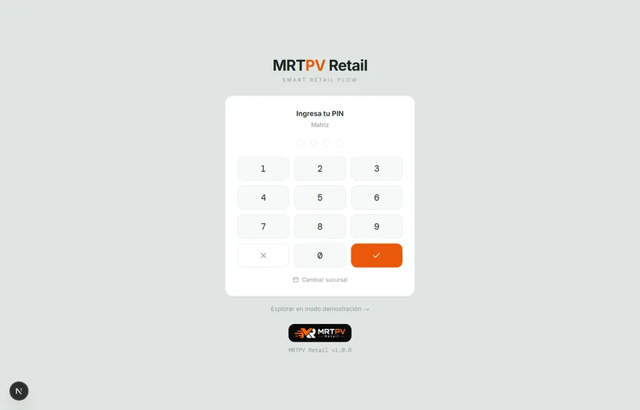
Pantalla del día a día: una vez vinculada la caja, el cajero solo teclea su PIN de 4 dígitos.

---

## 3. Cargar el catálogo

Los productos se cargan desde el **panel de administración**, en *Catálogo & Stock*. Cada artículo que vendes es un **SKU**: un código único con su precio, su costo y sus existencias.

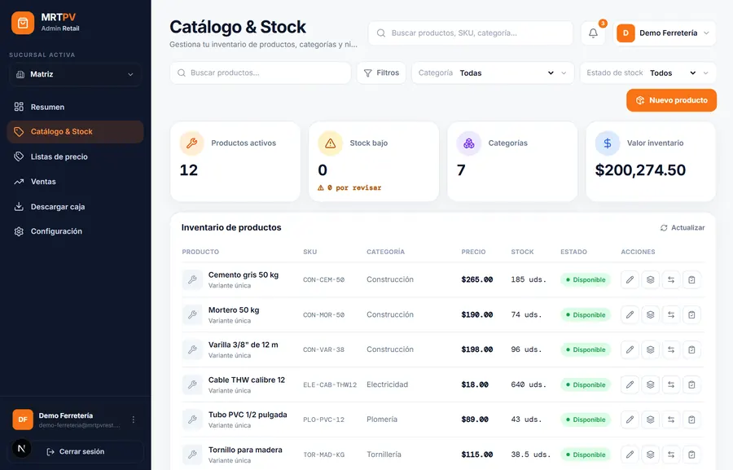
Catálogo & Stock: cada renglón es un SKU con su precio, existencias y estado.

### Dar de alta un producto

1. Abre *Catálogo & Stock → Nuevo producto*.
2. Escribe el **nombre, la categoría y la marca**.
3. Captura el **SKU y el código de barras**. Si el producto ya trae código de fábrica, escanéalo aquí para registrarlo.
4. Llena los **atributos de tu giro**. En ropa: talla, color, material. En ferretería: medida, rosca, material, presentación.
5. Pon el **precio y el costo**. El precio es con el que vendes; el costo sirve para calcular tu margen.
6. Elige la **unidad de venta**. Pieza (`PZA`) es lo normal. Para granel: `MTS`, `KG` o `LTS`. Para empaques: `CAJA`, `BULTO`, `CUBETA` o `PAQUETE`.

> [!NOTE]
> **La unidad manda.** Decide cómo se vende: un cable en `MTS` se cobra por **2.5 metros**; un tornillo en `PZA` se cuenta de uno en uno. Si además indicas cuántas piezas trae una caja, el cajero captura "2 cajas" y el sistema manda las piezas correctas al inventario.

### Etiquetas con código de barras

¿Tu producto no trae código de fábrica? La caja imprime **etiquetas** con código de barras CODE128 —nombre, precio y SKU— en la misma impresora térmica. Así puedes escanear todo, aunque sea a granel o de proveedor local.

---

## 4. Precios: listas y mayoreo

Un mismo producto puede tener varios precios según **quién compra** y **cuánto lleva**. Son dos cosas distintas y se combinan.

### Listas de precio — quién compra

Una lista de precio es un **tipo de cliente**. Lo típico en ferretería es tener "Público" y "Contratista". Al cobrar, el cajero elige la lista y el precio cambia solo.

- Las creas en el panel, en *Listas de precio*.
- **No tienes que capturar todo el catálogo**: un producto sin precio en la lista **hereda** su precio normal. Solo capturas los que cambian.
- Hay un botón para aplicar un **porcentaje sobre el catálogo** de un jalón (por ejemplo, "8% abajo para contratista"), con vista previa antes de guardar.

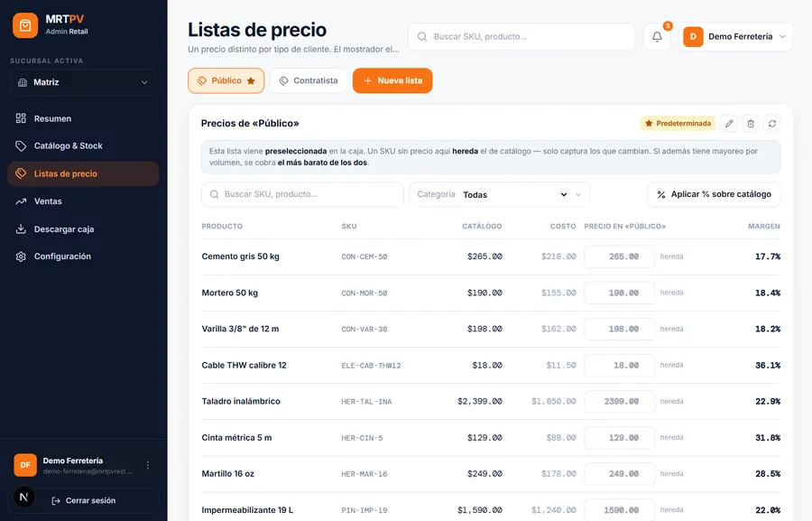
La estrella marca cuál viene preseleccionada en la caja. Donde dice "hereda", ese producto usa su precio de catálogo.

### Mayoreo — cuánto lleva

Además, puedes poner **escalones por volumen**: "de 100 piezas en adelante, el precio unitario baja". El sistema aplica el escalón automáticamente cuando la cantidad lo alcanza.

> [!NOTE]
> **Cómo se combinan.** Al cobrar, la caja aplica **el precio más barato** entre la lista del cliente y el escalón por cantidad. Un contratista que además compra volumen paga lo que más le convenga — nunca de más.

---

## 5. Vender y cobrar

Esta es la pantalla donde vive el cajero. El flujo es el mismo todos los días.

1. **Abre tu turno** (ver [Turnos y corte de caja](#7-turnos-y-corte-de-caja)) para que el corte del día cuadre.
2. **Agrega productos.** Escanea el código de barras, o escribe el SKU o el nombre. Luego confirma con **Agregar a la venta**.
3. **Ajusta variante y cantidad.** Para granel, escribe la cantidad con decimales (2.5 m). Para empaques, activa "por caja".
4. **Elige la lista de precio** del cliente si aplica. El total se recalcula solo.
5. **Cobra.** Elige la forma de pago —efectivo, tarjeta o transferencia— y confirma.
6. **Se imprime el ticket** y el inventario baja automáticamente.

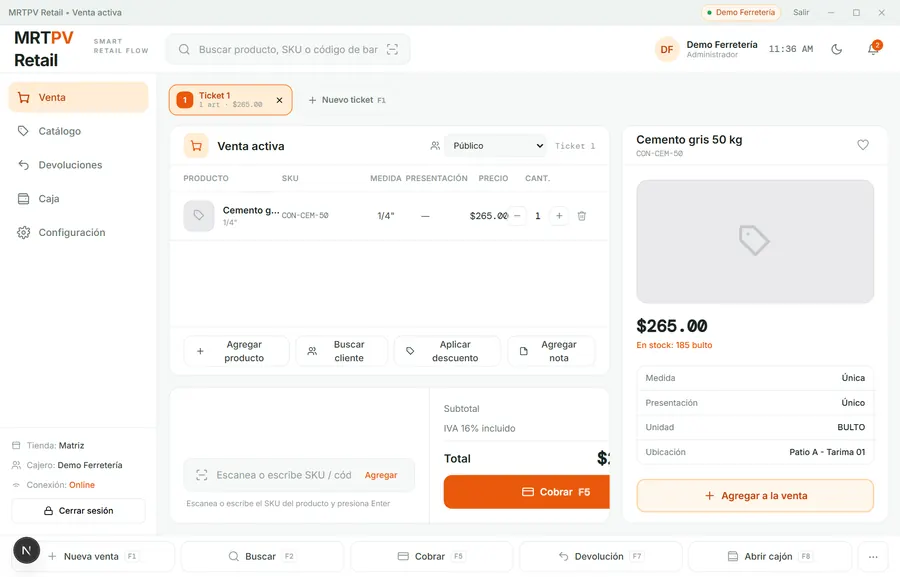
A la izquierda el ticket, arriba el selector de lista de precio, a la derecha el detalle del producto con su existencia y ubicación.

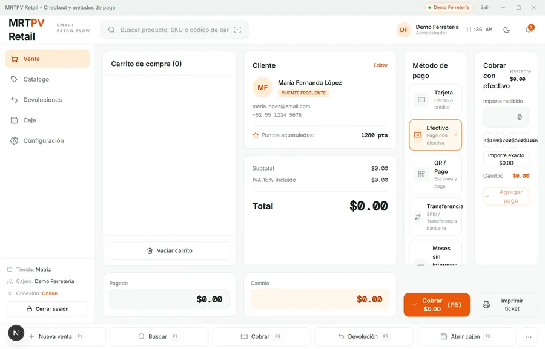
El cobro: eliges la forma de pago y confirmas. <b>Captura tomada antes del
rediseño de la versión 1.0.7</b> — el flujo es el mismo, pero la pantalla actual
tiene tres zonas (carrito · pago · resumen) y el botón dice directamente
"Cobrar $265.00".

### Si se cae el internet

La caja **sigue cobrando**. La venta se guarda en el equipo y se envía sola en
cuanto vuelve la conexión; arriba aparece un contador de "pendientes por enviar".
El ticket dirá *"Venta guardada"* y el folio queda "al sincronizar" — es normal.

> [!IMPORTANT]
> Mientras haya pendientes, esas ventas **todavía no están en el corte del
> servidor**. Antes de cerrar el turno, revisa que el contador esté en cero.

### Atajos de teclado

| Tecla | Acción |
|---|---|
| `F1` | Nueva venta (otro ticket sin perder el actual) |
| `F2` | Buscar producto |
| `F4` | Cambiar forma de pago (dentro del cobro) |
| `F5` | Cobrar · dentro del cobro, ejecuta la acción del botón |
| `F7` | Devolución |
| `F8` | Ir a Caja |

> [!WARNING]
> La barra inferior de la caja todavía rotula `F8` como **"Abrir cajón"**, pero
> la tecla lleva a la pantalla de Caja; no abre el cajón de dinero. Es una
> etiqueta equivocada en la app, pendiente de corregir.

> [!NOTE]
> **El total lo calcula el servidor.** El precio final siempre lo confirma el sistema, no la pantalla. Aunque haya listas, descuentos y mayoreo mezclados, el cobro cuadra: no se puede alterar el total desde la caja.

---

## 6. Devoluciones

Desde *Devoluciones* (o `F7`) buscas la venta por folio o cliente, la seleccionas y la devuelves. Al hacerlo, la venta se revierte y **el stock vuelve al inventario** automáticamente.

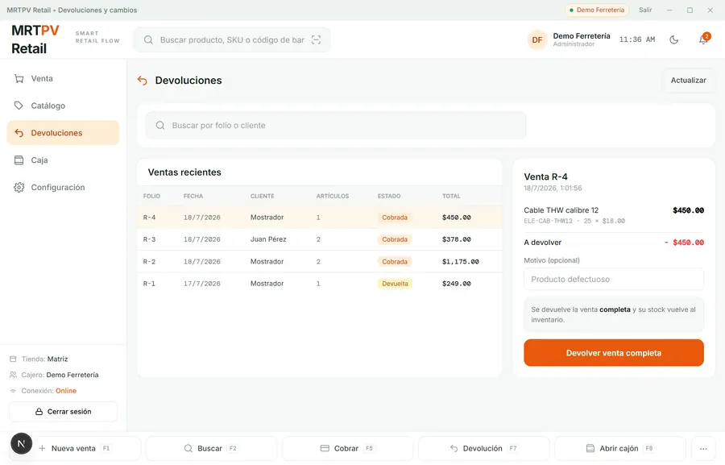
Eliges la venta de la lista y a la derecha ves qué llevaba. Las ya devueltas quedan marcadas.

> [!WARNING]
> **Se devuelve la venta completa.** La devolución revierte **todo el ticket**, no artículos sueltos. Si el cliente solo regresa una parte, cobra de nuevo lo que sí se queda. Una venta ya devuelta no se puede devolver otra vez, y hace falta un **usuario administrador** para autorizarla.

---

## 7. Turnos y corte de caja

Para que las cuentas cuadren, cada cajero **abre un turno** al empezar y lo **cierra** al terminar. Está en la pantalla *Caja*.

1. **Abre el turno** con el fondo de caja (el efectivo con el que arrancas).
2. **Vende normal.** El sistema va sumando ventas en efectivo, tarjeta y transferencia por separado.
3. **Cierra el turno.** Cuentas el efectivo real y el sistema te dice si sobra o falta contra lo esperado.

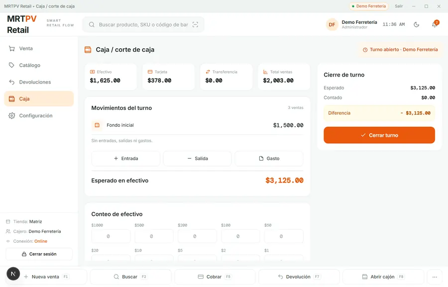
Caja durante un turno abierto: ventas por forma de pago, fondo inicial y cuánto efectivo deberías tener.

Para cerrar hay un **conteo por denominación**: capturas cuántos billetes y monedas de cada valor tienes y el sistema suma solo. Así no te equivocas con la calculadora, y la diferencia contra lo esperado sale al instante.

También puedes registrar **entradas y salidas de efectivo** (un retiro, un gasto chico) durante el turno para que el corte refleje la realidad.

---

## 8. Inventario

El stock baja solo con cada venta y sube con cada devolución. Además tienes control manual desde *Catálogo & Stock*:

- **Existencias** — cuánto tienes de cada SKU por sucursal, con alertas de stock bajo o agotado.
- **Traspasos** — mueves producto de una sucursal a otra; el inventario se ajusta en ambas.
- **Conteo físico** — cuentas lo que hay en el anaquel y capturas el número real para corregir diferencias.

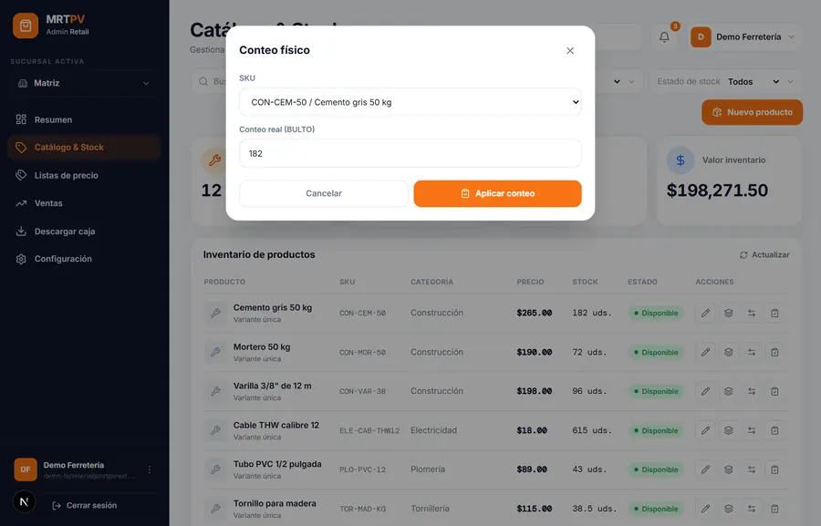
Eliges el producto y capturas lo que contaste. El sistema ajusta la existencia a ese número.

---

## 9. Panel de control

Desde el panel web ves cómo va el negocio sin estar en la caja:

- **Resumen** — ventas del día, número de tickets, productos con stock bajo y los más vendidos de hoy.
- **Ventas** — el histórico con su gráfica, el desglose por forma de pago y el detalle de cada ticket.
- **Catálogo, Listas de precio y Descargas** para administrar todo.

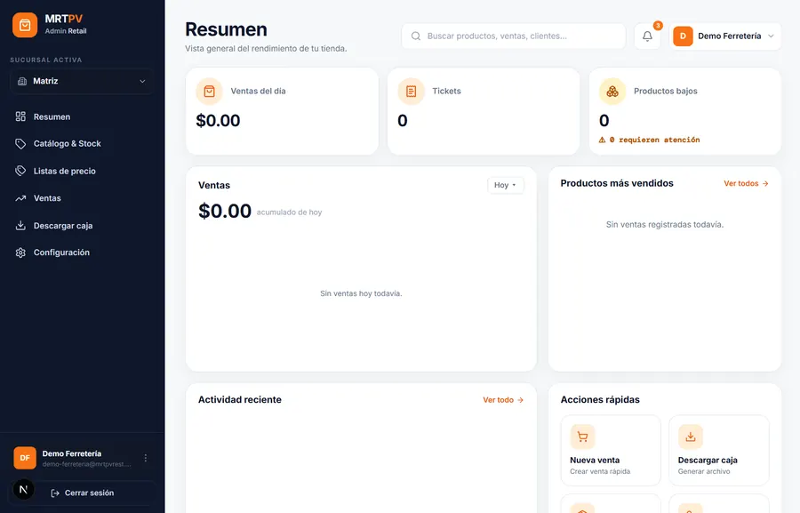
El resumen del día: cuánto llevas vendido, cuántos tickets y qué productos tienen el stock bajo.

> [!TIP]
> **Los números son en hora de México.** "Ventas del día" cuenta el día natural en tu zona horaria y suma **todas** las ventas, no una muestra.

---

## 10. Instalar el software

La caja corre en una **PC con Windows** o en una **tablet/celular Android**. Se descarga desde el panel, en *Descargar caja*.

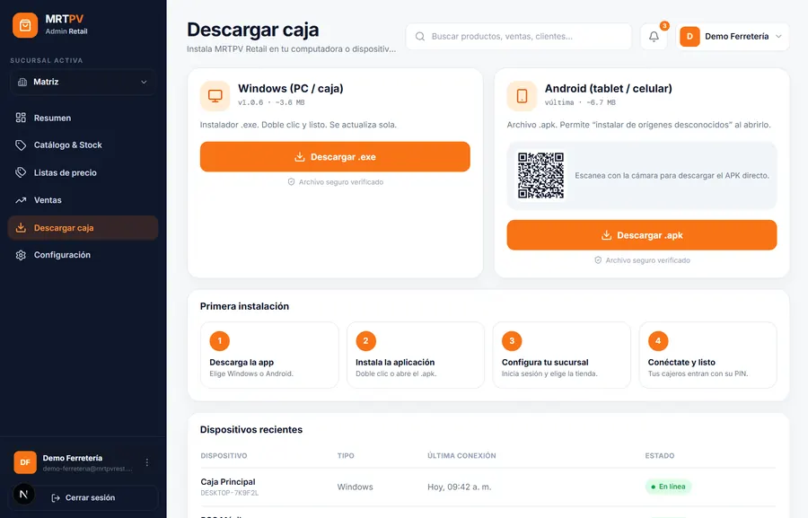
De aquí bajas el instalador de Windows o el archivo para Android. Siempre ofrece la última versión.

### En Windows (PC o caja)

1. En el panel, abre *Descargar caja* y descarga el instalador de Windows.
2. **Ejecuta el instalador.** Doble clic y siguiente. Se instala como "MRTPV Retail".
3. Ábrela y **vincula la caja** (ver [paso 2](#2-crear-tu-tienda-y-entrar)).

> [!TIP]
> **Aviso de Windows al instalar.** Puede mostrar "Editor desconocido" (SmartScreen). Es normal en apps que no pasan por la tienda: toca *Más información → Ejecutar de todas formas*. El instalador está firmado.

### En Android (tablet o celular)

1. Descarga el archivo `.apk` desde *Descargar caja*.
2. Ábrelo y permite **"instalar de orígenes desconocidos"** cuando Android lo pida.
3. **Vincula la caja** igual que en Windows.

---

## 11. Hardware recomendado

Puedes empezar solo con la PC o la tablet. El resto lo agregas según lo necesites.

| Equipo | Qué comprar | Necesidad |
|---|---|---|
| **Computadora o tablet** | PC con Windows 10/11, o tablet Android. Cualquiera de gama media aguanta. | Indispensable |
| **Impresora térmica** | Térmica de **80 mm**, compatible **ESC/POS**, con conexión de **red (Ethernet o WiFi)**. Ej.: Epson TM-T20III versión red. | Para ticket |
| **Lector de código de barras** | Lector USB en **modo teclado (HID)**, 1D (mínimo CODE128). Inalámbrico opcional. | Recomendado |
| **Cajón de dinero** | Cajón con conexión **RJ11/RJ12** que se enchufa a la impresora térmica. | Opcional |
| **Báscula** | Para venta a granel. Se usa como referencia: el cajero teclea el peso (no se conecta directo). | Opcional |

> [!IMPORTANT]
> **La impresora debe ser de RED.** MRTPV Retail imprime enviando el ticket por la **red local al puerto 9100** de la impresora. Por eso necesitas una impresora térmica **con Ethernet o WiFi**, no una que solo tenga USB. Es el detalle que más se confunde al comprar: pide el modelo **de red**.

---

## 12. Conectar el equipo

### Impresora térmica

1. **Conéctala a tu red** (cable Ethernet al módem/switch, o WiFi según el modelo).
2. **Dale una IP fija.** Imprime la hoja de auto-test para ver su IP, o asígnala desde su configuración. Que sea fija para que no cambie.
3. **Captúrala en la caja:** *Configuración → Impresora térmica*, escribe la **IP** y deja el **puerto 9100**.
4. **Imprime una prueba.** Si sale el ticket, quedó.

### Lector de código de barras

Conéctalo por USB. Funciona en **modo teclado**: al escanear, el código se "teclea" solo en la caja. No hay que instalar nada. Si tu lector trae hoja de configuración, déjalo en modo **HID/teclado**.

### Cajón de dinero

El cajón se conecta con su cable **RJ11/RJ12 a la impresora térmica** (no a la PC). La caja lo abre mandando el pulso a través de la impresora, con `F8` o al cobrar en efectivo.

---

## 13. Actualizaciones

MRTPV Retail **se actualiza sola**. Al abrir la app busca si hay una versión nueva, la descarga e instala, y se reinicia con lo último. No tienes que hacer nada.

Para **verificar qué versión tienes**, ve a *Configuración → Acerca de*. Ahí ves el número de versión y el estado de actualización, y hay un botón **Buscar actualización** por si quieres forzarla.

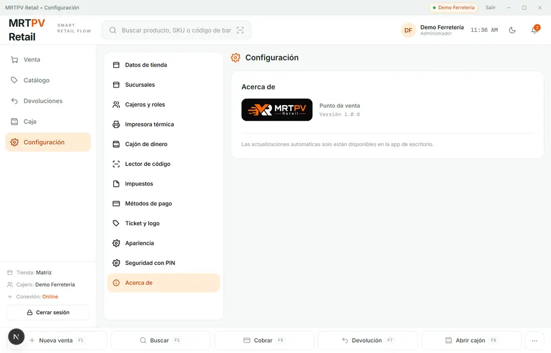
Aquí confirmas en qué versión está la caja y puedes forzar la búsqueda de actualizaciones.

En la pantalla de acceso, al pie, también aparece siempre la versión junto al logo.

---

## 14. Solución de problemas

### No imprime el ticket

- Revisa que la impresora esté **encendida y en la misma red** que la caja.
- Confirma la **IP** en *Configuración → Impresora térmica* y que el puerto sea `9100`.
- Haz `ping` a la IP de la impresora desde la PC. Si no responde, es tema de red, no de la caja.

### No escanea el lector

- Prueba el lector en el Bloc de notas: si ahí tampoco "teclea", está en el modo equivocado. Ponlo en **HID / teclado** con su hoja de configuración.
- Verifica que el código exista en tu catálogo (que lo registraste en el SKU).

### No abre el cajón

- El cajón se abre **a través de la impresora**: si la impresora no imprime, el cajón tampoco abre. Resuelve primero la impresora.
- Confirma que el cable RJ11 esté en el puerto del cajón de la impresora.

### El cobro no cuadra

- El total lo fija el servidor. Cierra el cobro y vuelve a abrirlo para que tome el precio actualizado.
- Si persiste, revisa que la lista de precio y el mayoreo del producto estén bien capturados en el panel.

> [!TIP]
> **Antes de llamar a soporte.** Ten a la mano tu **versión** (*Configuración → Acerca de*) y el **folio** de la venta con problema. Con eso se resuelve mucho más rápido.
